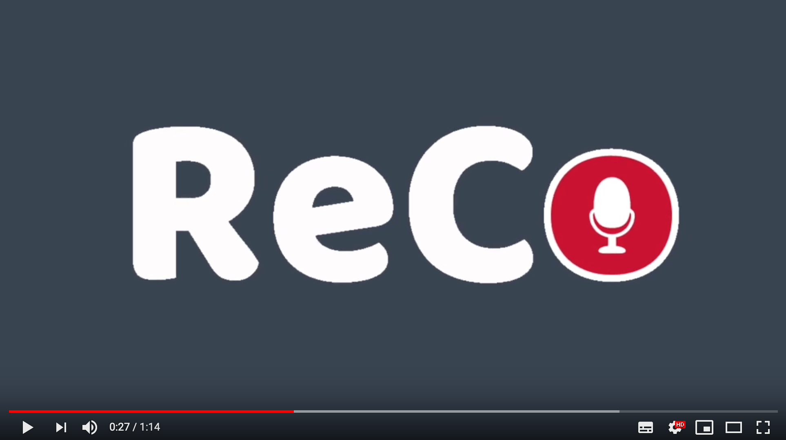

# RECO

## 製品概要
### 会話 Tech（X → 今回皆さんが選定した好きな言葉に書き換えてください）

### 背景（製品開発のきっかけ、課題等）
人とコミュニケーションを取った時、うまくいったorうまくいかなかったなど思い返すことが多々ある。
感覚でしか感じることができない、うまくいったorうまくいかなかったを可視化させ、復習することで、
自分のコミュニケーションスキルアップにつなげたい。
- 自分のコミュニケーションを客観視
- コミュ力、会話力という抽象的な物をデータ化
- 人とのコミュニケーションにおける、自分の必殺技をみつける（話題・トピック・コンテンツ）
-
を記入してください

### 製品説明（具体的な製品の説明）
会話のログから、自分のコミュニケーションを可視化させる。

### 特長

#### 1. 特長1

#### 2. 特長2

#### 3. 特長3

### 解決出来ること
この製品を利用することによって最終的に解決できることについて記載をしてください。

### 今後の展望
今回は実現できなかったが、今後改善すること、どのように展開していくことが可能かについて記載をしてください。

## 開発内容・開発技術
### 活用した技術
#### API・データ
プラットフォーム
*  Web
	* サーバ: Python(Flask)
	* クライアント: Jinja + css + p5.js

API

IBM Speech-To-Text API

#### フレームワーク・ライブラリ・モジュール
* 
* 

#### デバイス
* 
* 

### 研究内容・事前開発プロダクト（任意）
ご自身やチームの研究内容や、事前に持ち込みをしたプロダクトがある場合は、こちらに実績なども含め記載をして下さい。

* 
* 

### 独自開発技術（Hack Dayで開発したもの）
#### 2日間に開発した独自の機能・技術
* 独自で開発したものの内容をこちらに記載してください
* 特に力を入れた部分をファイルリンク、またはcommit_idを記載してください（任意）
